# MAPA DE FLUXOS DO SISTEMA
**Data:** 2026-06-26 | Baseado no código atual do repositório iphone-brasil

---

## 1. Cadastro de Produto (via painel admin — catálogo)

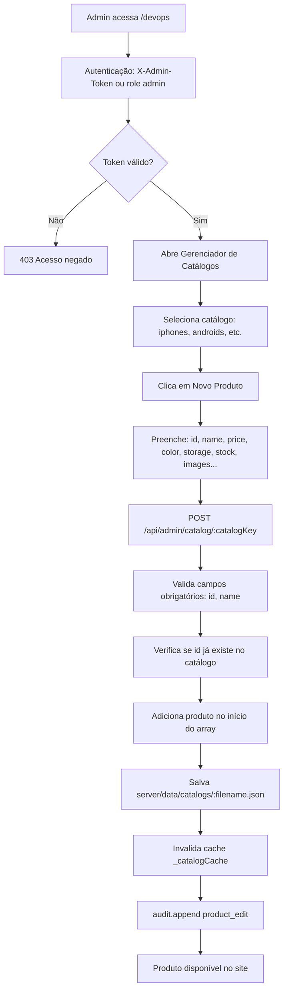

**Arquivos:** `server/index.js` (POST `/api/admin/catalog/:catalogKey`), `server/data/catalogs/*.json`, `server/audit.js`

**Riscos:**
- ID duplicado é rejeitado mas depende de unicidade manual
- Produto criado aparece imediatamente (sem revisão)
- Sem validação de imagens — URLs inválidas aparecem quebradas

---

## 2. Atualização de Preço

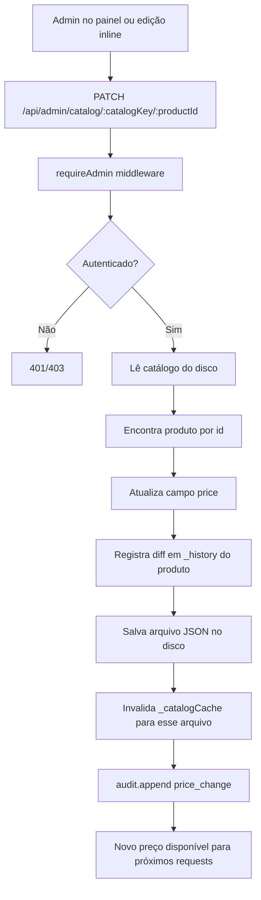

**Arquivos:** `server/index.js` (PATCH `/api/admin/catalog/:catalogKey/:productId`), `server/audit.js`

**Riscos:**
- Sem notificação ao cliente que tem esse produto no carrinho
- Cache em memória invalidado mas navegadores com a página aberta não são atualizados
- Produto em carrinho (localStorage) mantém o preço antigo até recarregar

---

## 3. Atualização de Estoque

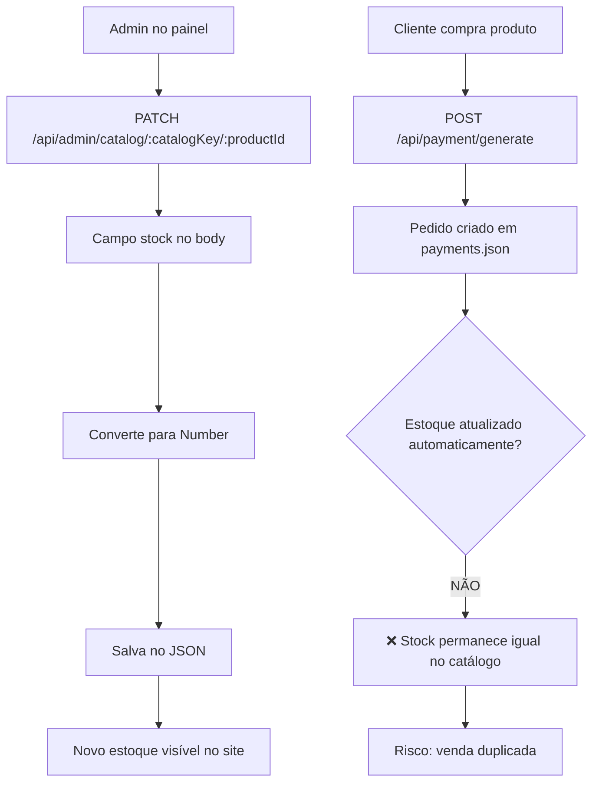

**Arquivos:** `server/index.js`, `server/payment.js`

**Problema crítico:** O estoque não é decrementado automaticamente quando um pedido é criado. Apenas a edição manual pelo admin reduz o `stock`.

---

## 4. Aplicação de Promoção

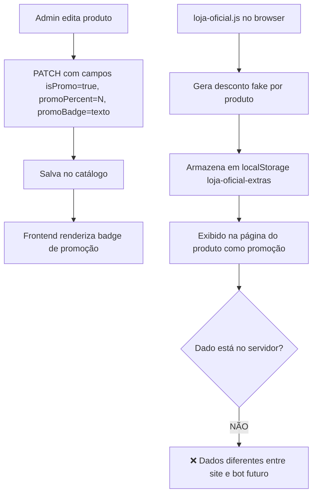

**Arquivos:** `server/index.js`, `public/js/loja-oficial.js`

**Risco crítico:** Promoções exibidas pelo `loja-oficial.js` são geradas no frontend e não existem no banco de dados.

---

## 5. Aplicação de Cupom

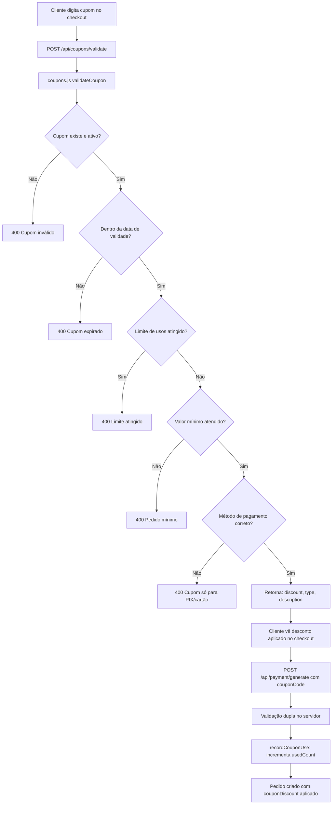

**Arquivos:** `server/coupons.js`, `server/index.js` (GET `/api/coupons/active`), `server/payment.js`

**Estado atual:** `server/data/coupons.json` está vazio — nenhum cupom cadastrado.

---

## 6. Cliente Acessando Catálogo

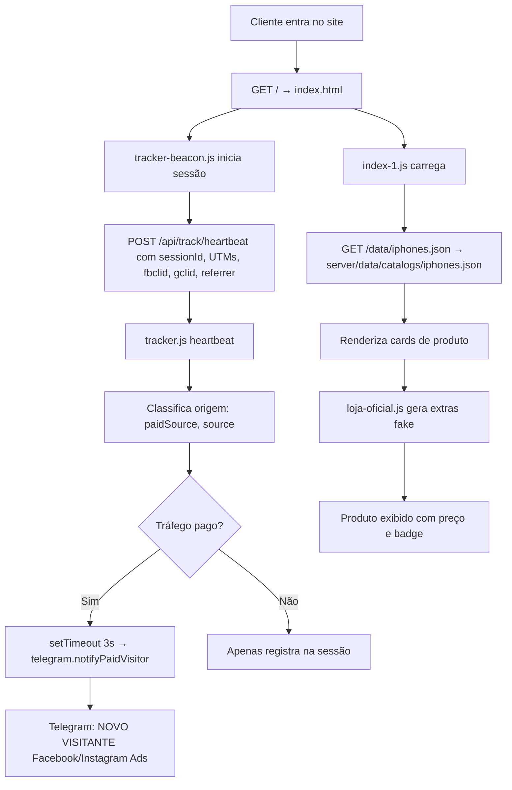

**Arquivos:** `server/tracker.js`, `server/telegram.js`, `public/pages/index-1.js`, `public/js/loja-oficial.js`, `public/js/tracker-beacon.js`

---

## 7. Cliente Visualizando Produto

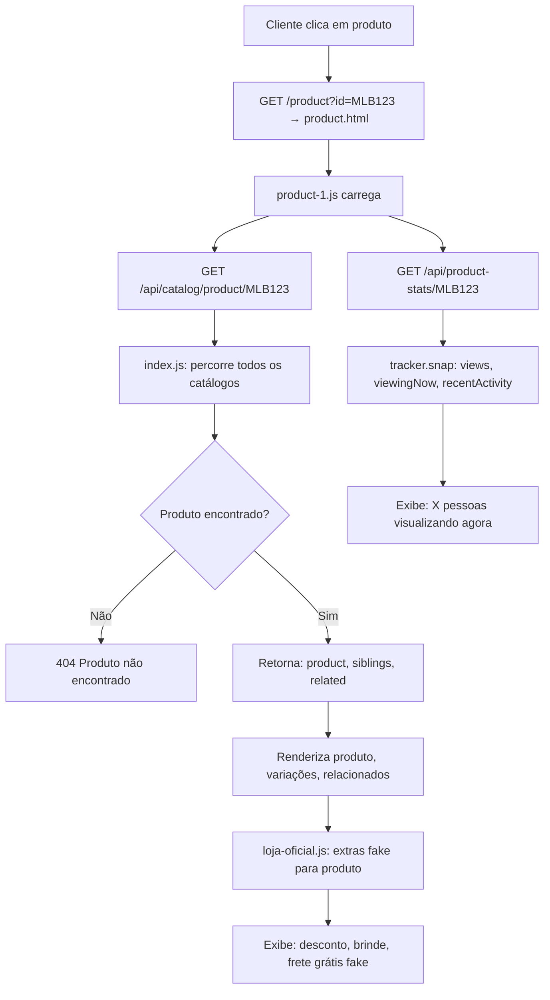

**Arquivos:** `server/index.js` (GET `/api/catalog/product/:id`), `public/pages/product-1.js`, `public/js/loja-oficial.js`

---

## 8. Cliente Adicionando ao Carrinho

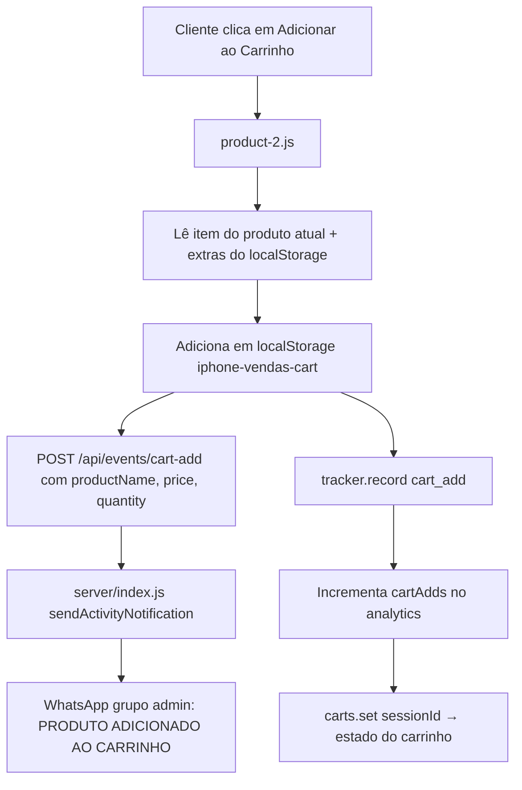

**Arquivos:** `server/index.js` (POST `/api/events/cart-add`), `public/pages/product-2.js`, `server/tracker.js`

---

## 9. Cliente Entrando no Checkout

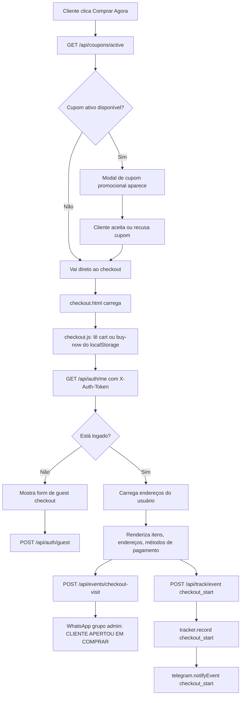

**Arquivos:** `server/index.js`, `public/js/checkout.js`, `public/js/coupon-modal.js`, `server/tracker.js`, `server/telegram.js`

---

## 10. Cliente Pagando (PIX)

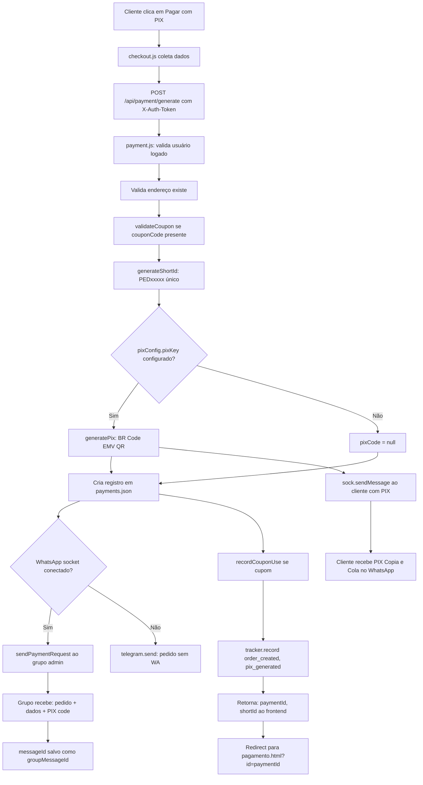

**Arquivos:** `server/payment.js`, `server/pix.js`, `server/whatsapp.js`, `server/coupons.js`, `server/tracker.js`, `server/telegram.js`

---

## 11. Pedido Sendo Criado

```mermaid
flowchart TD
    A[POST /api/payment/generate] --> B[newPayment object criado]
    B --> C{
      id: UUID,
      shortId: PEDxxxxx,
      status: pending,
      qrCode: PIX string ou null,
      clientPhone, clientName, clientEmail, clientCpf,
      userId, address, couponDiscount, logs[]
    }
    C --> D[payments.push newPayment]
    D --> E[savePayments: fs.writeFileSync payments.json]
    E --> F[Pedido persistido]
    
    F --> G[Gatilhos paralelos]
    G --> H[WA grupo admin notificado]
    G --> I[Cliente recebe PIX via WA]
    G --> J[Telegram notificado]
    G --> K[tracker.record order_created]
    G --> L[audit.append order_created]
```

---

## 12. Cliente Iniciando Conversa no WhatsApp

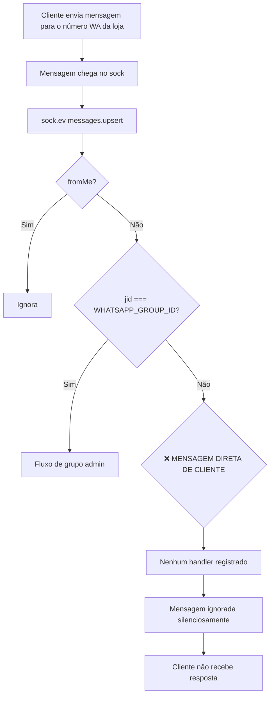

**Problema crítico:** O bot atual não possui listener para mensagens diretas de clientes. Toda a lógica é exclusiva do grupo admin.

---

## 13. Mensagem Chegando ao Bot (grupo admin)

```mermaid
flowchart TD
    A[Admin digita no grupo WA] --> B[sock.ev messages.upsert]
    B --> C[Extrai: text, contextInfo, quotedMsgId]
    C --> D[Tenta identificar pedido]
    D --> E{Método 1: reply groupMessageId}
    E -- Encontrou --> F[payment identificado]
    E -- Não --> G{Método 2: reply proofGroupMessageId}
    G -- Encontrou --> F
    G -- Não --> H{Método 3: UUID no texto}
    H -- Encontrou --> F
    H -- Não --> I{Método 4: shortId PEDxxxxx no texto}
    I -- Encontrou --> F
    I -- Não --> J{Método 5: UUID na mensagem citada}
    J -- Encontrou --> F
    J -- Não --> K[Pedido não identificado → ignora]
    
    F --> L{Texto começa com APROVADO?}
    L -- Sim --> M[payment.status = paid, paidAt, tracking gerado]
    M --> N[sendMessage ao cliente: Pagamento Aprovado]
    
    F --> O{Texto começa com RECUSADO?}
    O -- Sim --> P[payment.status = refused, refuseReason]
    P --> Q[sendMessage ao cliente: Pagamento Recusado + motivo]
    
    F --> R{Texto começa com REENVIAR?}
    R -- Sim --> S[proofs=[], status=pending]
    S --> T[sendMessage ao cliente: Enviar novo comprovante]
    
    F --> U{Tem mídia ou texto?}
    U -- Sim --> V[downloadMediaMessage ou texto]
    V --> W[sock.sendMessage ao clientJid]
    W --> X[Conteúdo encaminhado ao cliente]
```

**Arquivos:** `server/whatsapp.js` (messages.upsert handler)

---

## 14. Bot Consultando Produto

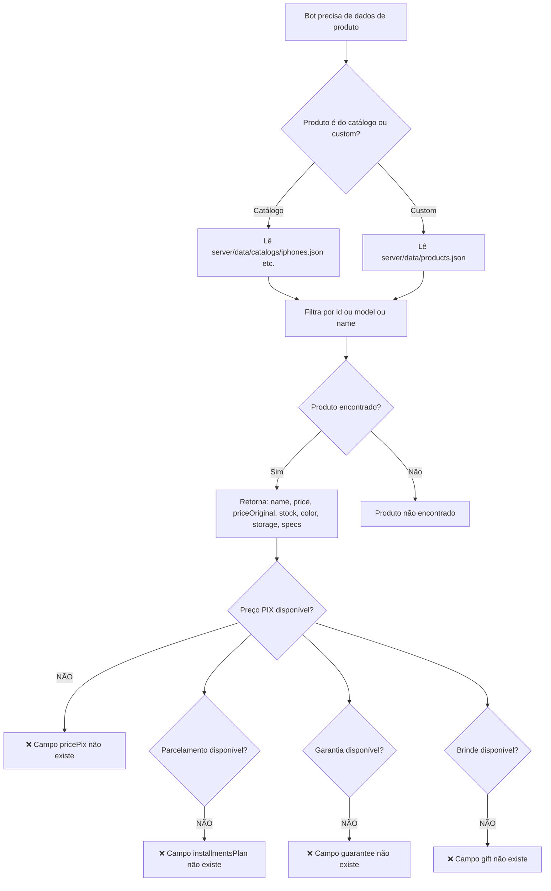

**Nota:** A consulta acima descreve o que **seria possível** de implementar no bot. Atualmente o bot não realiza nenhuma consulta de catálogo.

---

## 15. Bot Respondendo Preço

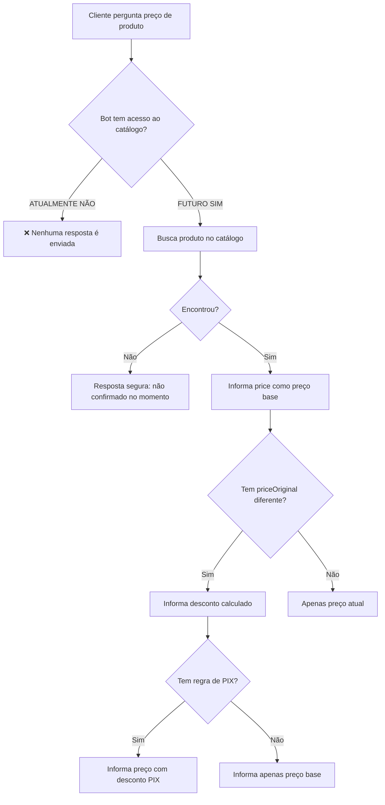

---

## 16. Bot Respondendo Estoque

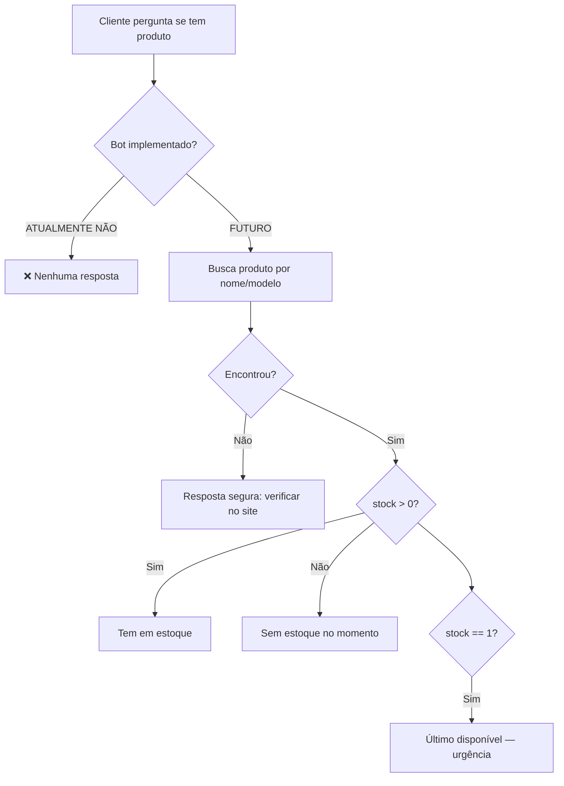

---

## 17. Bot Enviando Link do Produto

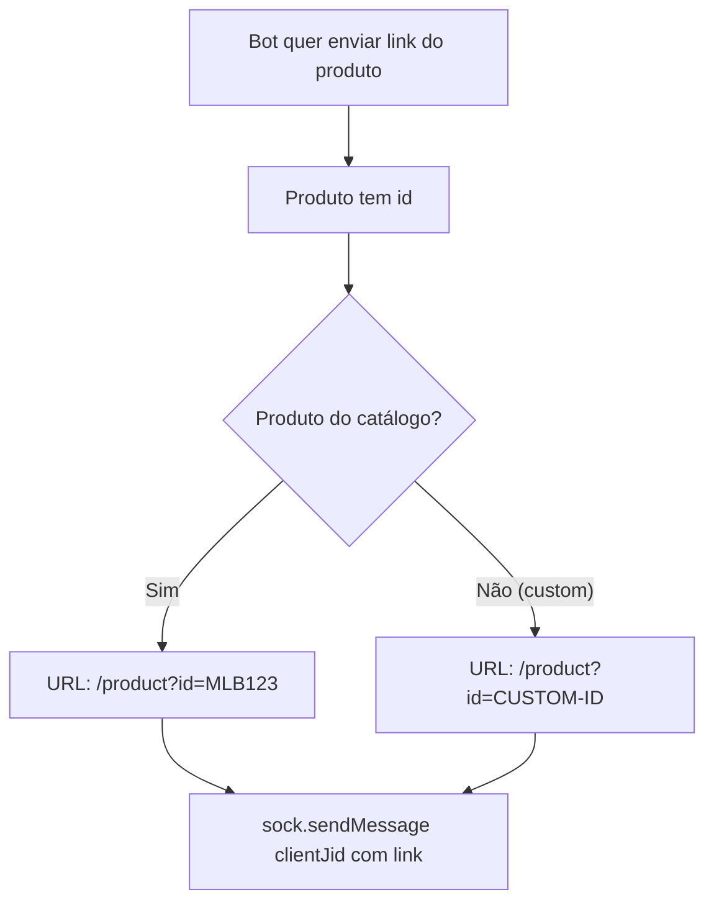

---

## 18. Cliente Vindo de Anúncio

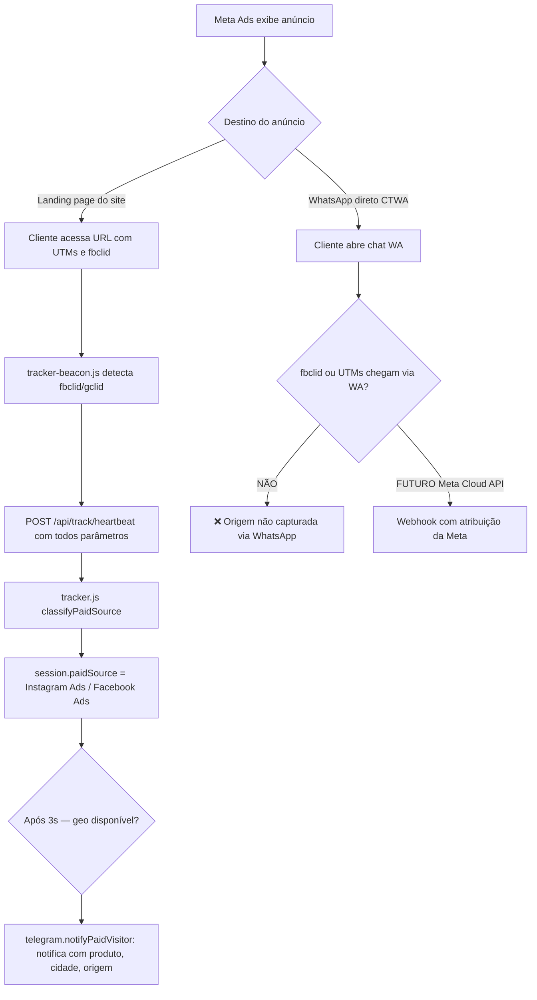

**Limitação atual:** Campanhas com destino "Clique para WhatsApp" não transmitem UTMs ou fbclid ao bot Baileys.

---

## 19. Sistema Registrando Origem do Lead

```mermaid
flowchart TD
    A[Heartbeat recebido] --> B[tracker.heartbeat]
    B --> C[Armazena na sessão: source, paidSource, utmSource, utmCampaign, fbclid, gclid]
    C --> D[Persiste em analytics/visitors.json]
    D --> E{Lead faz pedido?}
    E -- Sim --> F[POST /api/payment/generate]
    F --> G[Tracker record order_created com sessionId]
    G --> H{sessionId tem campanha?}
    H -- Sim --> I[dayData.campaigns[camp].pixPaid++ ou checkouts++]
    H --> J[telegram.notifyEvent com campaign]
    
    E -- Não --> K[Origem perdida quando fecha o browser]
    K --> L[Não é salva no pedido se não converter]
```

**Limitação:** A origem do lead só é associada ao pedido indiretamente via `telegram.notifyEvent`. O campo `campaign` ou `source` não é salvo diretamente no registro do pedido em `payments.json`.

---

## 20. Bot Enviando Cliente para Checkout

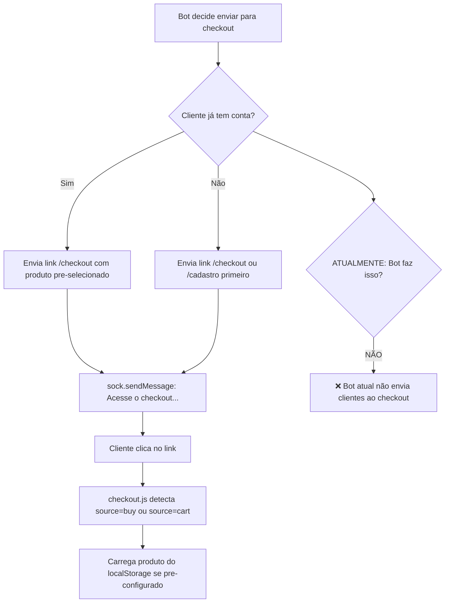

---

## 21. Cliente Consultando Pedido

```mermaid
flowchart TD
    A[Cliente acessa /meus-pedidos] --> B[GET /api/auth/orders com X-Auth-Token]
    B --> C{Autenticado?}
    C -- Não --> D[401 Não autenticado]
    C -- Sim --> E[Filtra payments.json por userId]
    E --> F{Pedido paid sem tracking?}
    F -- Sim --> G[generateTracking: cria rastreamento simulado]
    G --> H[Salva tracking no payment]
    F --> I[Retorna lista de pedidos com status, tracking]
    H --> I
    I --> J[meus-pedidos.html renderiza cards]
    J --> K[Exibe: status, produto, valor, tracking steps]
```

**Arquivos:** `server/index.js` (GET `/api/auth/orders`), `server/shipping.js`, `public/meus-pedidos.html`

---

## 22. Cliente Consultando Entrega

```mermaid
flowchart TD
    A[Cliente clica em rastrear pedido] --> B[Acessa tracking do pedido em meus-pedidos.html]
    B --> C[Exibe steps do tracking object]
    C --> D[steps: payment_approved, preparing, dispatched, in_transit, out_for_delivery, delivered]
    D --> E{Steps são reais?}
    E -- NÃO --> F[❌ Gerados pelo shipping.js com base em dias estimados por CEP]
    F --> G[Usuário vê datas/locais simulados]
    G --> H[Não reflete a movimentação real do produto]
```

---

## Legenda de Riscos

| Símbolo | Significado |
|---|---|
| ✅ | Implementado e funcionando |
| ❌ | Não implementado ou dado ausente |
| ⚠️ | Implementado com limitações |

---

## Sumário de Gargalos por Fluxo

| Fluxo | Principal Gargalo |
|---|---|
| Cadastro de produto | Manual, sem validação de imagens |
| Atualização de preço | Estoque e preço no carrinho não atualiza em tempo real |
| Estoque | Não decrementado automaticamente ao vender |
| Promoção | Dados fake no frontend, invisíveis ao servidor |
| Pagamento cartão | Manual, dados do cartão em texto via WhatsApp |
| Bot mensagens diretas | Nenhum handler — mensagens de clientes ignoradas |
| Rastreamento | Simulado — não reflete realidade |
| Origem de leads via WA | Não capturada quando cliente vem via anúncio CTWA |
